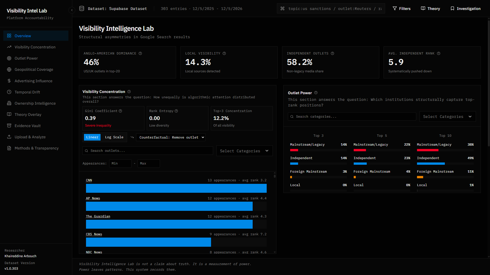

# Visibility Intelligence Lab

A research-grade analytical dashboard for auditing search engine visibility and media power concentration. This application analyzes structural asymmetries in Google Search results, media ownership patterns, and algorithmic attention distribution.



## Table of Contents

- [Overview](#overview)
- [Architecture](#architecture)
- [Technology Stack](#technology-stack)
- [Data Pipelines](#data-pipelines)
- [Project Structure](#project-structure)
- [Setup Instructions](#setup-instructions)
- [Features](#features)
- [API Documentation](#api-documentation)
- [Database Schema](#database-schema)
- [Development Workflow](#development-workflow)
- [Deployment](#deployment)
- [Contributing](#contributing)

## Overview

Visibility Intelligence Lab is a comprehensive research tool designed to measure and visualize power structures in digital information ecosystems. The application processes Search Engine Results Page (SERP) data to reveal patterns of media concentration, ownership influence, and algorithmic bias.

### Key Capabilities

- SERP data analysis and visualization
- Media outlet power concentration metrics
- Ownership mapping and analysis
- Geopolitical media matrix visualization
- Temporal drift tracking
- Advertising influence analysis
- Theory-driven investigation tools

## Architecture

### System Architecture

The application follows a modern full-stack architecture with clear separation of concerns:

```
┌─────────────────────────────────────────────────────────────┐
│                     Client Layer (Next.js)                   │
│  ┌──────────────┐  ┌──────────────┐  ┌──────────────┐     │
│  │  Components  │  │  Visualizations│  │   Hooks      │     │
│  └──────────────┘  └──────────────┘  └──────────────┘     │
│                                                              │
│  ┌──────────────────────────────────────────────────────┐   │
│  │         Data Context (React Context API)             │   │
│  │  - SupabaseDataProvider                              │   │
│  │  - DataProvider (local fallback)                     │   │
│  └──────────────────────────────────────────────────────┘   │
└─────────────────────────────────────────────────────────────┘
                            │
                            ▼
┌─────────────────────────────────────────────────────────────┐
│                    API Layer (Next.js API Routes)            │
│  ┌──────────────────┐  ┌──────────────────┐                │
│  │ /api/ownership/* │  │  Future endpoints │                │
│  └──────────────────┘  └──────────────────┘                │
└─────────────────────────────────────────────────────────────┘
                            │
                            ▼
┌─────────────────────────────────────────────────────────────┐
│                  Data Layer (Supabase)                      │
│  ┌──────────────┐  ┌──────────────┐  ┌──────────────┐     │
│  │ serp_entries │  │   outlets    │  │  ownership_* │     │
│  └──────────────┘  └──────────────┘  └──────────────┘     │
│                                                              │
│  ┌──────────────────────────────────────────────────────┐   │
│  │         Materialized Views & Functions                │   │
│  │  - outlet_metrics                                    │   │
│  │  - ownership_summary                                  │   │
│  └──────────────────────────────────────────────────────┘   │
└─────────────────────────────────────────────────────────────┘
```

### Component Architecture

The application uses a component-based architecture with the following hierarchy:

1. **Layout Layer** (`app/layout.tsx`)
   - Root layout with providers
   - Error boundaries
   - Global styles and fonts

2. **Page Layer** (`app/page.tsx`)
   - Main dashboard view
   - View routing and state management
   - Global controls (search, filters, theory mode)

3. **Feature Components** (`components/`)
   - Specialized panels for different views
   - Reusable UI components
   - Visualization components

4. **Data Layer** (`lib/data/`)
   - Data context providers
   - Data transformation utilities
   - Parser implementations

5. **Business Logic** (`lib/metrics/`)
   - Metric calculation functions
   - Statistical analysis utilities
   - Data aggregation logic

### Data Flow

1. **Initial Load**
   - SupabaseDataProvider fetches data from Supabase on mount
   - Data is transformed into internal Dataset format
   - Metrics are calculated client-side
   - Context provides data to all components

2. **User Interactions**
   - User actions trigger state updates in page component
   - Components subscribe to data context
   - Visualizations re-render with filtered/computed data

3. **Data Updates**
   - New data can be uploaded via UploadAnalyze component
   - Data is parsed and validated
   - Can be stored locally or uploaded to Supabase
   - Context refreshes to show new data

## Technology Stack

### Frontend

- **Next.js 16** - React framework with App Router
- **React 19** - UI library
- **TypeScript** - Type safety
- **Tailwind CSS 4** - Styling
- **Radix UI** - Accessible component primitives
- **Recharts** - Data visualization
- **Lucide React** - Icons

### Backend & Database

- **Supabase** - PostgreSQL database with real-time capabilities
- **Next.js API Routes** - Serverless API endpoints
- **Row Level Security (RLS)** - Database security

### Data Processing

- **Python 3** - Data transformation scripts
- **Pandas** - Data manipulation
- **NumPy** - Numerical operations
- **XLSX** - Excel file parsing
- **PapaParse** - CSV parsing

### Development Tools

- **pnpm** - Package manager
- **tsx** - TypeScript execution
- **ESLint** - Code linting
- **TypeScript** - Type checking

## Data Pipelines

### Pipeline 1: SERP Data Migration

**Purpose**: Migrate Excel/CSV SERP data to Supabase database

**Steps**:

1. **Input**: Excel file (`data/Visibility_Table.xlsx`)
   - Contains SERP entries with query, outlet, rank, date, etc.

2. **Processing**: `scripts/migrate-to-supabase.ts`
   - Reads Excel file using XLSX library
   - Normalizes column names and data types
   - Maps categories to enum values (mainstream, foreign, independent, local)
   - Validates and cleans data

3. **Transformation**:
   - Extracts unique outlets
   - Creates outlet records in `outlets` table
   - Creates SERP entry records in `serp_entries` table
   - Handles batch uploads (500 rows per batch)

4. **Output**: 
   - Data stored in Supabase `serp_entries` and `outlets` tables
   - Materialized views updated automatically

**Usage**:
```bash
pnpm migrate:supabase
```

### Pipeline 2: Ownership Data Transformation

**Purpose**: Transform hierarchical ownership CSV data into normalized database structure

**Steps**:

1. **Input**: CSV file (`data/Ownership_Map.csv`)
   - Semicolon-separated format
   - Contains hierarchical ownership data (holders and portfolios)
   - European number format (dots as thousands, commas as decimals)

2. **Processing**: `scripts/transform_ownership_data.py`
   - Reads CSV with semicolon separator
   - Skips header rows (12 rows)
   - Cleans numeric values (handles both US and European formats)
   - Separates top-level holders (Tree Level 0-1) from portfolios (Tree Level 2+)
   - Aggregates holder positions
   - Maps portfolios to parent holders

3. **Transformation**:
   - Normalizes numeric formats
   - Parses dates (DD.MM.YYYY format)
   - Categorizes holders and portfolios
   - Creates JSON structure with holders and portfolios arrays

4. **Output**: `data/ownership_transformed.json`
   - Structured JSON ready for database insertion
   - Contains summary statistics

**Usage**:
```bash
cd scripts
python transform_ownership_data.py
```

### Pipeline 3: Ownership Data Migration

**Purpose**: Migrate transformed ownership data to Supabase

**Steps**:

1. **Input**: Transformed JSON (`data/ownership_transformed.json`)

2. **Processing**: `scripts/migrate_ownership_to_supabase.py`
   - Reads transformed JSON
   - Inserts holders into `ownership_holders` table
   - Links portfolios to holders via foreign keys
   - Inserts portfolios into `ownership_portfolios` table

3. **Output**:
   - Data stored in Supabase ownership tables
   - Materialized view `ownership_summary` updated

**Usage**:
```bash
cd scripts
python migrate_ownership_to_supabase.py
```

### Pipeline 4: Client-Side Data Processing

**Purpose**: Transform Supabase data into application Dataset format

**Steps**:

1. **Input**: Raw Supabase queries
   - `serp_entries` table data
   - `outlets` table data

2. **Processing**: `lib/data/supabase-data-context.tsx`
   - Fetches data from Supabase
   - Groups entries by outlet
   - Calculates outlet metrics (avgRank, capture rates)
   - Groups entries by query
   - Calculates global metrics (Gini coefficient, concentration, etc.)

3. **Transformation**:
   - Creates Outlet objects with computed properties
   - Creates Query objects with SERP entries
   - Builds Dataset object with all metrics

4. **Output**: Dataset object in React Context
   - Available to all components via `useSupabaseData()` hook

### Pipeline 5: File Upload and Processing

**Purpose**: Allow users to upload and analyze new data files

**Steps**:

1. **Input**: User-uploaded file (Excel or CSV)

2. **Processing**: `components/upload-analyze.tsx`
   - Detects file type (Excel or CSV)
   - Uses appropriate parser (`excel-parser.ts` or `csv-parser.ts`)
   - Validates data schema
   - Transforms to internal format

3. **Transformation**:
   - Normalizes column names
   - Infers categories if not present
   - Validates required fields
   - Creates Dataset object

4. **Output**:
   - Dataset stored in local state (via `setLocalDataset`)
   - Can optionally be uploaded to Supabase
   - Visualizations update immediately

## Project Structure

```
visibility-intelligence-lab/
├── app/                          # Next.js App Router
│   ├── api/                      # API routes
│   │   └── ownership/            # Ownership API endpoints
│   │       ├── tickers/          # GET /api/ownership/tickers
│   │       └── upload/            # POST /api/ownership/upload
│   ├── page.tsx                  # Main dashboard page
│   ├── layout.tsx                # Root layout with providers
│   ├── globals.css               # Global styles
│   ├── error.tsx                 # Error boundary page
│   ├── loading.tsx               # Loading state
│   └── not-found.tsx             # 404 page
│
├── components/                   # React components
│   ├── ui/                       # Reusable UI components (Radix UI)
│   ├── visualizations/          # Data visualization components
│   │   ├── visibility-concentration-map.tsx
│   │   ├── top-rank-capture.tsx
│   │   ├── geo-media-matrix.tsx
│   │   ├── temporal-drift.tsx
│   │   └── advertising-layer.tsx
│   ├── ownership-panel.tsx       # Ownership analysis panel
│   ├── ownership-unified.tsx     # Unified ownership view
│   ├── ownership-upload.tsx      # Ownership data upload
│   ├── upload-analyze.tsx        # File upload component
│   ├── investigation-panel.tsx   # Investigation tools
│   ├── evidence-vault.tsx         # Evidence storage
│   ├── methods-panel.tsx          # Methodology documentation
│   ├── theory-overlay.tsx         # Theory framework overlay
│   └── sidebar.tsx                # Navigation sidebar
│
├── lib/                          # Core libraries
│   ├── data/                     # Data management
│   │   ├── data-context.tsx      # Local data provider
│   │   ├── supabase-data-context.tsx  # Supabase data provider
│   │   ├── dataset-utils.ts      # Dataset utilities
│   │   └── parsers/              # File parsers
│   │       ├── csv-parser.ts
│   │       ├── excel-parser.ts
│   │       └── schema.ts
│   ├── metrics/                  # Metric calculations
│   │   ├── index.ts              # Unified exports
│   │   ├── concentration.ts      # Gini, entropy, concentration
│   │   ├── capture.ts            # Top-rank capture metrics
│   │   ├── stability.ts          # Temporal stability
│   │   └── geopolitical.ts      # Geo-political metrics
│   ├── supabase/                 # Supabase client
│   │   ├── client.ts             # Browser client
│   │   ├── server.ts             # Server client
│   │   └── types.ts              # TypeScript types
│   ├── types/                    # Type definitions
│   │   └── domain.ts             # Domain models
│   └── utils/                    # Utility functions
│       ├── format-query.ts
│       └── utils.ts
│
├── scripts/                      # Data processing scripts
│   ├── transform_ownership_data.py    # Transform ownership CSV
│   ├── migrate_ownership_to_supabase.py  # Migrate ownership data
│   ├── migrate-to-supabase.ts   # Migrate SERP data
│   ├── check-env.ts              # Environment check
│   └── README_OWNERSHIP_SCRIPTS.md
│
├── supabase/                     # Database schemas
│   ├── schema.sql                # Main SERP schema
│   └── ownership_schema.sql      # Ownership schema
│
├── data/                         # Data files
│   ├── Visibility_Table.csv      # SERP data (CSV)
│   ├── Ownership_Map.csv         # Ownership data (CSV)
│   └── ownership_transformed.json  # Transformed ownership (generated)
│
├── docs/                         # Documentation
│   ├── README_OWNERSHIP.md       # Ownership feature guide
│   └── SUPABASE_SETUP_GUIDE.md   # Supabase setup guide
│
├── analysis/                     # Jupyter notebooks
│   ├── 01_visibility_table_analysis.ipynb
│   └── 02_ownership_map_analysis.ipynb
│
├── public/                       # Static assets
│   ├── BK logo.png
│   ├── BK logo.svg
│   └── robots.txt
│
├── hooks/                        # Custom React hooks
│   ├── use-mobile.ts
│   └── use-toast.ts
│
├── styles/                       # Additional styles
│   └── globals.css
│
├── package.json                  # Dependencies
├── pnpm-lock.yaml                # Lock file
├── tsconfig.json                 # TypeScript config
├── next.config.mjs               # Next.js config
├── postcss.config.mjs           # PostCSS config
└── components.json               # shadcn/ui config
```

## Setup Instructions

### Prerequisites

- Node.js 18+ and pnpm 9+
- Python 3.8+ (for data transformation scripts)
- Supabase account and project
- Git

### Step 1: Clone Repository

```bash
git clone https://github.com/khaireddine-arbouch/Visibility-Intelligence-Lab.git
cd visibility-intelligence-lab
```

### Step 2: Install Dependencies

```bash
pnpm install
```

For Python scripts:
```bash
pip install pandas numpy supabase python-dotenv
```

### Step 3: Environment Configuration

Create `.env.local` file:

```env
# Supabase Configuration
NEXT_PUBLIC_SUPABASE_URL=https://your-project.supabase.co
NEXT_PUBLIC_SUPABASE_ANON_KEY=your-anon-key
SUPABASE_SERVICE_ROLE_KEY=your-service-role-key

# Optional
NEXT_PUBLIC_SITE_URL=http://localhost:3000
```

### Step 4: Database Setup

1. Create a Supabase project at [database.new](https://database.new)

2. Run the main schema:
   - Open Supabase SQL Editor
   - Copy contents of `supabase/schema.sql`
   - Execute the SQL

3. Run the ownership schema (optional):
   - Copy contents of `supabase/ownership_schema.sql`
   - Execute the SQL

### Step 5: Data Migration

**For SERP Data**:
```bash
pnpm migrate:supabase
```

**For Ownership Data**:
```bash
cd scripts
python transform_ownership_data.py
python migrate_ownership_to_supabase.py
```

### Step 6: Start Development Server

```bash
pnpm dev
```

Open [http://localhost:3000](http://localhost:3000)

## Features

### Core Features

1. **Overview Dashboard**
   - Key metrics visualization
   - Visibility concentration map
   - Top-rank capture analysis
   - Geo-media matrix
   - Advertising influence layer

2. **Visibility Analysis**
   - Concentration metrics (Gini coefficient)
   - Top-rank capture rates
   - Outlet power rankings
   - Category-based analysis


3. **Ownership Mapping**
   - Institutional holder analysis
   - Portfolio breakdowns
   - Geographic distribution
   - Institution type analysis
   - Ownership change tracking


4. **Geopolitical Analysis**
   - Country-based filtering
   - Topic-based filtering
   - Cross-country media dominance
   - Local vs. foreign visibility


5. **Temporal Analysis**
   - Ranking stability tracking
   - Temporal drift visualization
   - Historical trend analysis


6. **Theory Framework**
   - Manufacturing Consent lens
   - Platform Capitalism analysis
   - Digital Colonialism perspective
   - Theory trace mode


7. **Investigation Tools**
   - Evidence vault
   - Hypothesis tracking
   - Bookmarking system
   - Investigation panel


8. **Data Upload**
   - Excel file support
   - CSV file support
   - Real-time validation
   - Immediate visualization

9. **Advertising Influence Analysis**
   - Commercial viability metrics
   - Advertising layer visualization
   - Revenue-based visibility patterns


10. **Methods & Transparency**
    - Methodology documentation
    - Data collection processes
    - Research transparency tools


### Key Metrics

- **Anglo-American Dominance**: Percentage of top-20 positions held by US/UK outlets
- **Local Visibility**: Proportion of local media outlets in search results
- **Independent Outlets**: Share of independent, non-corporate media
- **Average Independent Rank**: Mean ranking position for independent outlets
- **Gini Coefficient**: Measure of inequality in outlet appearances
- **Top-Three Concentration**: Percentage of top-3 positions held by top outlets

## API Documentation

### Ownership API

#### GET /api/ownership/tickers

Returns list of available tickers with company names.

**Response**:
```json
[
  {
    "ticker": "WBD",
    "company_name": "Warner Bros Discovery Inc"
  }
]
```

#### POST /api/ownership/upload

Upload ownership data (implementation pending).

## Database Schema

### SERP Data Schema

#### Table: `serp_entries`

Stores individual SERP entries.

| Column | Type | Description |
|--------|------|-------------|
| id | BIGINT | Primary key |
| query | TEXT | Search query |
| outlet | TEXT | Media outlet name |
| rank | INTEGER | Search result rank (1-100) |
| date | DATE | Date of search |
| title | TEXT | Article title |
| url | TEXT | Article URL |
| category | ENUM | Outlet category |
| country | TEXT | Outlet country |
| created_at | TIMESTAMPTZ | Creation timestamp |
| updated_at | TIMESTAMPTZ | Update timestamp |

#### Table: `outlets`

Stores media outlet information.

| Column | Type | Description |
|--------|------|-------------|
| id | BIGINT | Primary key |
| name | TEXT | Outlet name (unique) |
| category | ENUM | Outlet category |
| country | TEXT | Country |
| headquarters | TEXT | Headquarters location |
| parent | TEXT | Parent company |
| ownership | TEXT | Ownership information |
| affiliations | TEXT | Affiliations |
| created_at | TIMESTAMPTZ | Creation timestamp |
| updated_at | TIMESTAMPTZ | Update timestamp |

#### Materialized View: `outlet_metrics`

Aggregated metrics per outlet.

| Column | Type | Description |
|--------|------|-------------|
| outlet | TEXT | Outlet name |
| total_appearances | BIGINT | Total appearances |
| avg_rank | NUMERIC | Average rank |
| best_rank | INTEGER | Best rank achieved |
| worst_rank | INTEGER | Worst rank |
| top_three_count | BIGINT | Appearances in top 3 |
| top_five_count | BIGINT | Appearances in top 5 |
| top_ten_count | BIGINT | Appearances in top 10 |
| rank_volatility | NUMERIC | Standard deviation of ranks |
| primary_category | ENUM | Most common category |
| first_appearance | DATE | First appearance date |
| last_appearance | DATE | Last appearance date |

### Ownership Schema

#### Table: `ownership_holders`

Stores top-level institutional holders.

| Column | Type | Description |
|--------|------|-------------|
| id | BIGINT | Primary key |
| holder_name | TEXT | Holder name |
| ticker | TEXT | Stock ticker |
| total_position | BIGINT | Total shares held |
| total_percent_out | NUMERIC(5,2) | Percentage of outstanding |
| latest_change | BIGINT | Recent position change |
| institution_type | TEXT | Type of institution |
| country | TEXT | Country |
| metro_area | TEXT | Metropolitan area |
| insider_status | TEXT | Insider/Non-insider |
| tree_level | INTEGER | Hierarchical level |
| created_at | TIMESTAMPTZ | Creation timestamp |
| updated_at | TIMESTAMPTZ | Update timestamp |

#### Table: `ownership_portfolios`

Stores individual portfolios/funds.

| Column | Type | Description |
|--------|------|-------------|
| id | BIGINT | Primary key |
| holder_id | BIGINT | Foreign key to holders |
| portfolio_name | TEXT | Portfolio/fund name |
| position | BIGINT | Shares in portfolio |
| percent_out | NUMERIC(5,2) | Percentage of outstanding |
| percent_portfolio | NUMERIC(5,2) | Portfolio allocation |
| latest_change | BIGINT | Position change |
| filing_date | DATE | SEC filing date |
| source | TEXT | Data source |
| tree_level | INTEGER | Hierarchical level |
| parent_holder_id | BIGINT | Parent holder reference |
| created_at | TIMESTAMPTZ | Creation timestamp |
| updated_at | TIMESTAMPTZ | Update timestamp |

#### Materialized View: `ownership_summary`

Aggregated ownership metrics per ticker.

| Column | Type | Description |
|--------|------|-------------|
| ticker | TEXT | Stock ticker |
| total_holders | BIGINT | Number of holders |
| total_shares | BIGINT | Total shares |
| total_percent_out | NUMERIC | Total percentage |
| avg_holder_percent | NUMERIC | Average holder percentage |
| total_portfolios | BIGINT | Number of portfolios |
| countries_represented | BIGINT | Number of countries |
| institution_types | BIGINT | Number of institution types |
| last_updated | TIMESTAMPTZ | Last update timestamp |

### Security

All tables use Row Level Security (RLS):

- **Read Access**: Public (anon and authenticated users)
- **Write Access**: Authenticated users only
- **Delete Access**: Authenticated users only

## Development Workflow

### Adding New Metrics

1. Create calculation function in `lib/metrics/`
2. Export from `lib/metrics/index.ts`
3. Add to Dataset type in `lib/types/domain.ts`
4. Calculate in data context providers
5. Display in relevant components

### Adding New Visualizations

1. Create component in `components/visualizations/`
2. Accept data via props or context
3. Use Recharts for charts
4. Follow existing visualization patterns
5. Add to appropriate view in `app/page.tsx`

### Adding New Data Sources

1. Create parser in `lib/data/parsers/`
2. Add schema validation
3. Update upload component to support new format
4. Transform to internal Dataset format
5. Optionally add Supabase migration script

### Database Migrations

1. Create SQL file in `supabase/`
2. Test in Supabase SQL Editor
3. Document in relevant guide
4. Update schema documentation

## Deployment

### Vercel Deployment

1. Connect repository to Vercel
2. Configure environment variables:
   - `NEXT_PUBLIC_SUPABASE_URL`
   - `NEXT_PUBLIC_SUPABASE_ANON_KEY`
   - `SUPABASE_SERVICE_ROLE_KEY` (for API routes)
3. Deploy

### Environment Variables

Required for production:
- `NEXT_PUBLIC_SUPABASE_URL`
- `NEXT_PUBLIC_SUPABASE_ANON_KEY`
- `NEXT_PUBLIC_SITE_URL` (for metadata)

Optional:
- `SUPABASE_SERVICE_ROLE_KEY` (for server-side operations)

### Build Process

```bash
pnpm build
pnpm start
```

### Performance Optimization

- Materialized views for aggregated metrics
- Database indexes on frequently queried columns
- Client-side caching via React Context
- Lazy loading for heavy visualizations
- Image optimization via Next.js Image component

## Contributing

### Code Style

- TypeScript strict mode
- ESLint for linting
- Prefer functional components
- Use TypeScript interfaces for types
- Follow existing naming conventions

### Commit Messages

Use conventional commits:
- `feat:` New feature
- `fix:` Bug fix
- `docs:` Documentation
- `refactor:` Code refactoring
- `test:` Tests
- `chore:` Maintenance

### Pull Request Process

1. Create feature branch
2. Make changes
3. Test thoroughly
4. Update documentation
5. Submit PR with description

## Contact

[khaireddine.com](https://khaireddine.com/contact/)